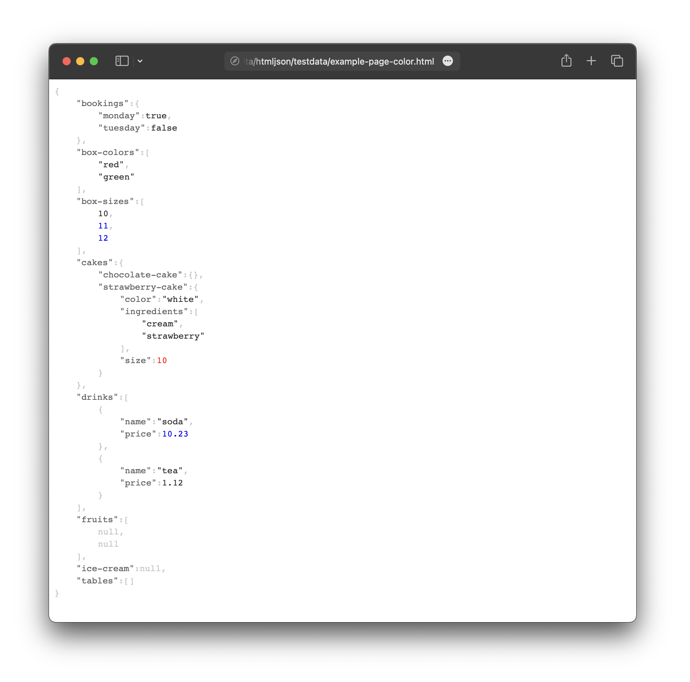

## 🫐 htmljson

[](https://codecov.io/gh/nikolaydubina/htmljson)
[](https://goreportcard.com/report/github.com/nikolaydubina/htmljson)
[](https://pkg.go.dev/github.com/nikolaydubina/htmljson)

> Rich rendering of JSON as HTML in Go

* pure Go
* no Javascript
* no dependencies
* no `reflect`
* no `fmt`
* 300 LOC
* customizable rendering
* JSON Path in for elements access



```go
// JSON has to be any
var v any
json.Unmarshal(exampleJSON, &v)

// customize how to render HTML elements
// use JSON path to find your element
s := htmljson.Marshaler{
    Null:   htmljson.NullHTML,
    Bool:   htmljson.BoolHTML,
    String: htmljson.StringHTML,
    Number: func(k string, v float64, s string) string {
        if k == "$.cakes.strawberry-cake.size" {
            return `<div class="json-value json-number" style="color:red;">` + s + `</div>`
        }
        if v > 10 {
            return `<div class="json-value json-number" style="color:blue;">` + s + `</div>`
        }
        return `<div class="json-value json-number">` + s + `</div>`
    },
    Array: htmljson.DefaultArrayHTML,
    Map:   htmljson.DefaultMapHTML,
    Row:   htmljson.DefaultRowHTML{Padding: 4}.Marshal,
}

// write HTML page
htmlPage := strings.ReplaceAll(htmljson.DefaultHTMLPageTemplate, `{{.HTMLJSON}}`, string(s.Marshal(v)))
```
